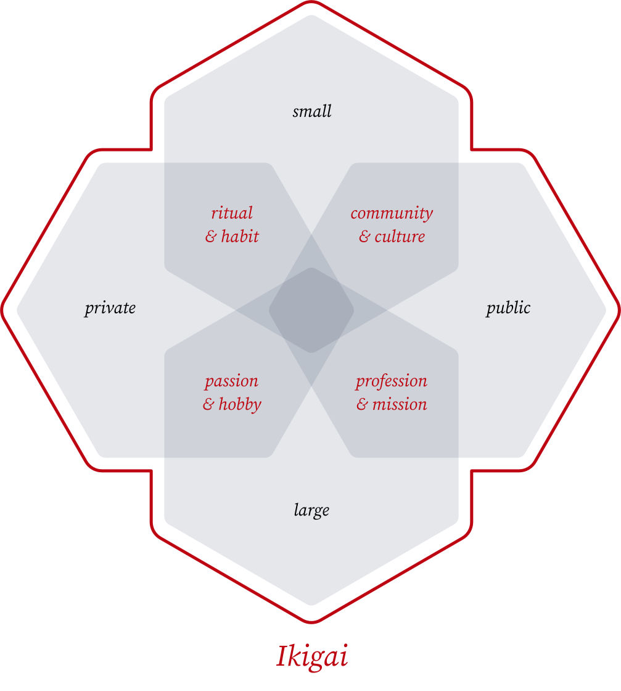

Years ago I came across the concept of "Ikigai" (or "life's reason") in [a blog
post][marc winn's blog post], along with an explanatory four-axis venn
diagram[^meme-seeding]. It introduced the idea of honing in on a life's purpose
by way of doing what you're good at, what you enjoy, what the world needs, and
what you can be paid for. This really resonated with me.

[^meme-seeding]: Years later, Marc wrote a [follow up
post][marc winn's follow up] on the origins of his article on Ikigai and
addressed how it took on a life of its own.

I find this model a helpful tool in thinking about my own career, but it's
important to remember that it's just that: a model. While I like the framework,
as I've read more about Ikigai I also have some real concerns with it:

- It's mired in the pseudo-science of "self help" that I'm really suspicious of.
  Most books frame Ikigai as an elusive thing to start searching for today, that
  you need to find happiness, and need coaching to achieve.

- It feels like yet another foreign cultural fetishization. Ikigai is a Japanese
  concept but nearly all material written on it is English.

- The origins of Ikigai's introduction to English readers is via a [TED
  talk][dan buettner's ted talk] on the unusual lives of centenarians in
  Okinawa, Japan which don't seem to relate to the venn diagram; where did that
  come from?

These concerns turn out to be valid. In fact the origin of this venn diagram is
not Japanese at all, but instead comes from a book by Spanish Astrologist,
Andrés Zuzunaga. [Marc Winn's blog post] combined [Andrés Zuzunaga's original
graphic] with the idea of Ikigai presented in [Dan Buettner's TED talk] and
voilà, a meme!

Despite it's shortcomings and misappropriation I still really like this mental
model for considering career progression and debugging gaps in a sense of
fulfillment. Here's my translation of [Andrés Zuzunaga's original graphic] in
English:

Ikigai is still a very real concept, just not the same one as presented by most
of these blog posts and books. Japanese neuroscientist Ken Mogi (who has also
written a book on Ikigai, mostly about food) has [a video][ken mogi's video]
addressing this venn diagram with an attempt to bring the term back to an
original intent. In the video he proposes a new (crude, hand-drawn) diagram to
take its place with two distinct changes:

- The four circles of the venn diagram are replaced with two axis: small to big
  and private to public.

- Rather than Ikigai being found at the center of this diagram, he emphatically
  repeats that _all of it_ is Ikigai.

The goal being not to find the one perfect thing which checks all boxes but
instead to cultivate a broad diversity of things big and small, public and
private, to bring a rich multifaceted purpose to life.

I also appreciate this very different model, and took the liberty to capture
Ken's ["true Ikigai diagram"][ken mogi's video] with a few additions in a
similar spirit:

[marc winn's blog post]: https://theviewinside.me/what-is-your-ikigai/
[marc winn's follow up]: https://theviewinside.me/meme-seeding/
[dan buettner's ted talk]:
  http://www.ted.com/talks/dan_buettner_how_to_live_to_be_100
[andrés zuzunaga's original graphic]: https://www.cosmograma.com/proposito.php
[ken mogi's video]: https://youtu.be/a_2RIydy_NQ
