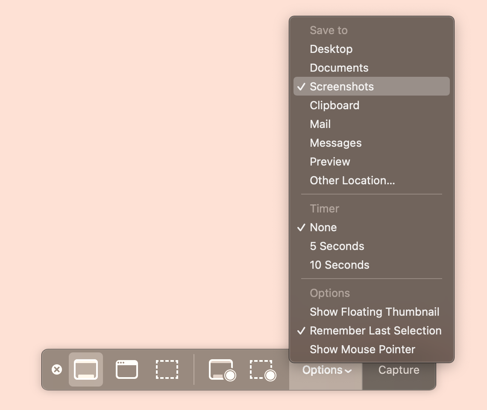

Mac has some keyboard shortcuts for capturing your screen via an app called
"Screenshot."

- Capture your entire screen with Command+Shift+3
- Capture a portion of the screen with Command+Shift+4, then drag and release a
  rectangle.
  - Before dragging, press space bar to toggle on capture window mode, then
    click the window to capture. This has the nice benefit of including the
    window's drop shadow with image transparency.
- Pull up the Screenshot app with Command+Shift+5[^finder], and access the three
  image capture modes as well as two video capture modes and an options menu.

[^finder]:
    Or you can open it directly via Finder. It's in `/Applications/Utilities`
    and called "Screenshot.app"

By default all screenshots are saved to the Desktop. To keep your Desktop from
becoming a junk drawer, I highly recommend saving them in some other dedicated
location. I personally create a folder called "Screenshots" that I put at the
top level of my Dropbox folder. If you don't use Dropbox, consider a folder in
your home directory.

Open the Screenshot app and in the bar that appears click "Options", and under
the "Save to" heading choose "Other Location" and choose or create the dedicated
folder. Afterwards, I recommend adding your Screenshots folder to your Finder's
sidebar for quick access.

While you're at it, take a look at the other options. I like to disable "Show
Floating Thumbnail" since that feature delays saving the screenshot to disk for
a number of seconds.

Alternatively, you can use the `defaults` terminal command:

```sh
defaults write com.apple.screencapture location "~/Dropbox/Screenshots"
```

To make sure it worked (and check your other settings):

```sh
defaults read com.apple.screencapture
```


