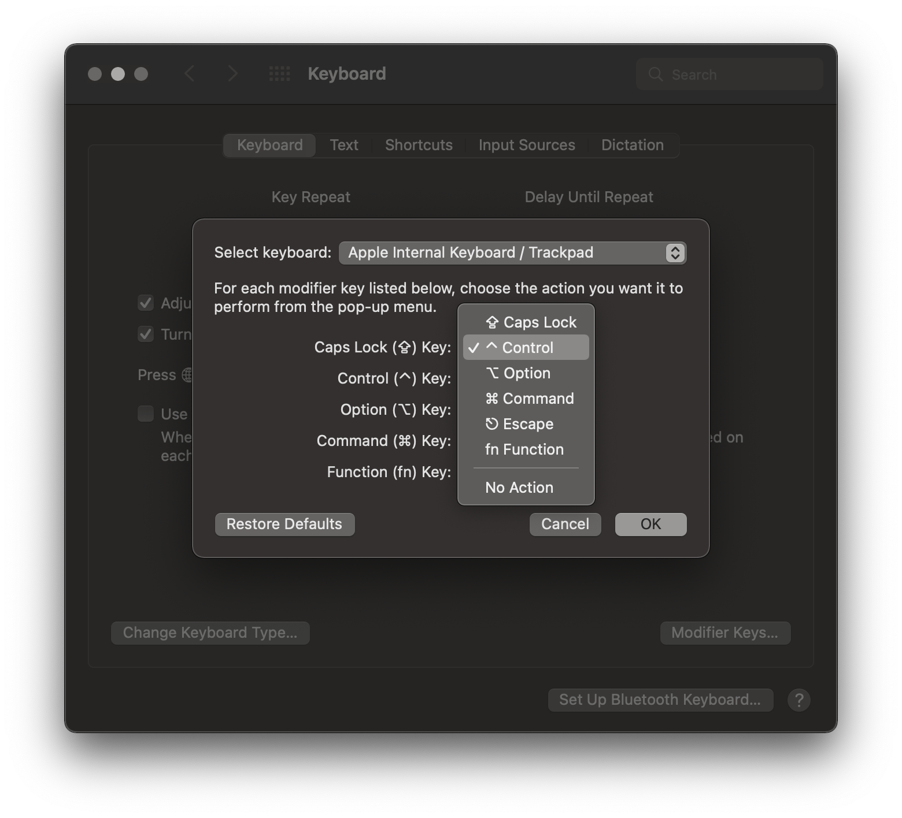

The caps lock key is conveniently located next to your left pinkie on the home
row, easier to press than almost all other modifiers despite being one I find
least useful. Luckily, macOS makes it very easy to remap this key[^alternative].

[^alternative]: There is other software for much more powerful key
  remapping, which I'll write about in the future. It's nice that this is an
  OS-provided preference, so you can quickly set it without installing anything.

In System Preferences → Keyboard, press "Modifier Keys..." to open a menu
mapping physical keys to the action they apply. I always remap my caps lock key
to "Control", since I spend a fair amount of time in Terminal, where Control is
used a fair amount (like Control-C to send `SIGINT`, or Control-Z to send
`SIGTSTP`).

