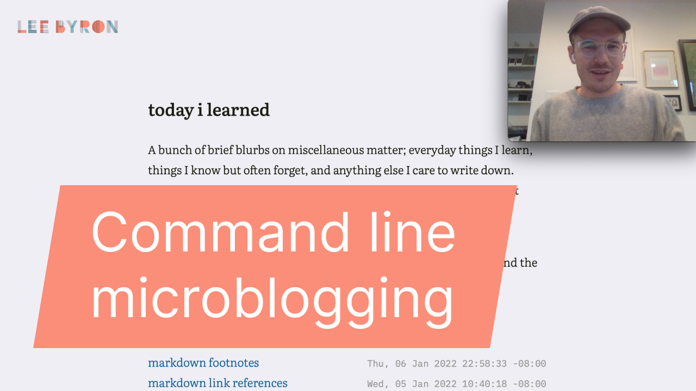

This is a paragraph with _italics_, and **bold** text, as well as
~strikethrough~. Here is `inline *code*` and below is a block of typescript
code:

```ts
function foo(bar: string): number {
  return (bar + 'quote').length
}
```

And another language

```vim
:set syntax
```

This has no language

```
Just a code block
```

And an unknown language

```unknownlang
who knows how to highlight this?
```

---

Here is a footnote[^note] and another footnote[^other].

[^other]: Another other other thing.
[^note]: Another thing you need to know!

> And here is a block quote which can also have both footnotes[^see] and
> definitions of footnotes
>
> [^see]: This is inside the block quote.

---

Text can contain [links] and auto-links, as well as images:

http://this.is/an/autolink

![image]

[image]: https://uploads0.wikiart.org/images/sol-lewitt/lines-in-all-directions-1993.jpg 'Lines in all directions'
[links]: https://leebyron.com 'go home'

---

Here is a list starting with 2

2. item
3. item
4. item

And an unordered list

- first item
  - [x] done
  - [ ] in progress
- next item
  - nested
- final item
  1. nested ordered

And here is a table with various alignments

| left aligned | right aligned | not aligned | center aligned |
| :----------- | ------------: | ----------- | :------------: |
| here         |  there[^note] | anywhere    |   over there   |
| 1            |             2 | 3           |       4        |

And here is a block of HTML

<div style="text-align: center;"><span style="color: red;">Oh hi</span></div>

<!-- And here is a comment -- it should not appear in the output -->


