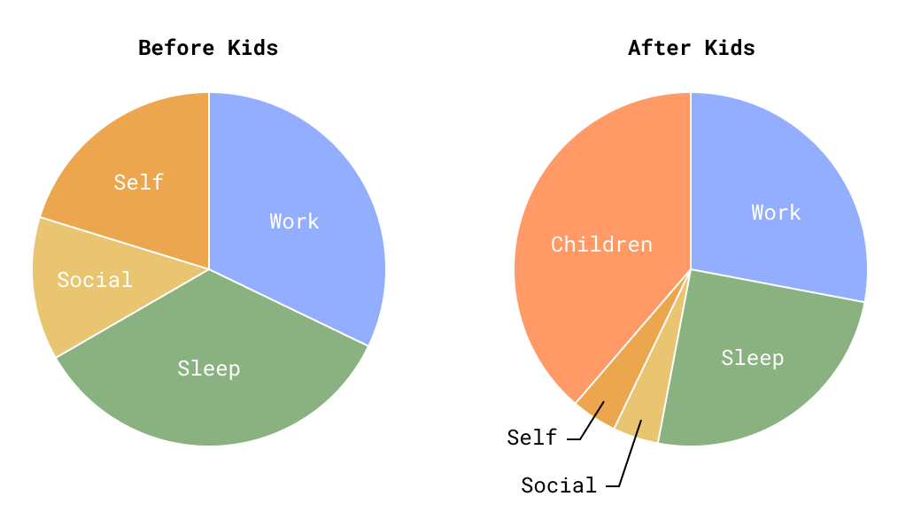

As part of a recent reflection of my mental health and self care routines, and a
desire to tighten up my work/life balance, I tracked how I spend my time over
the course of a week. What became most clear was just how much time I spend on
childcare of my two young sons (4yo and 1yo).

I repeated this from a typical week a few years ago, before we had our kids,
which left a clear high-level comparison of how having kids has impacted the
balance of my time.

To add a little bit of color:

- **Work** is the time I spend on my job and career. This is the portion of time
  which changed the least, mostly due to job expectations and my own desire to
  continue investing in having career impact.
- **Sleep** took a significant hit. My brain chemistry seems to require a lot of
  sleep, I am definitely not one of those people who thrives on 4 hours a night,
  I need _at least_ 6 hours. Anyone who has young kids can empathize with the
  struggle to maintain a healthy sleep schedule.
- **Social** is the dedicated time I spend with my wife and my friends. The
  dramatic reduction has stress-tested my partnership and greatly limited my
  time with friends. This used to be even lower, but over the last few months
  has recovered a bit to where it is today.
- **Self** is the time I spend on myself, either recharging and playing games or
  working on creative projects. This is the portion which has taken the greatest
  hit, and I believe is to blame for the pressure I'm feeling on my mental
  health. I've also found myself so tired from limited sleep, work pressure, and
  the toil of childcare that I spend all of this time on podcasts or mindless
  games (and bad habits like reading Reddit/News) and don't have contiguous time
  to spend on creative projects.
- **Childcare** is the time I spend with my kids, almost always with my wife as
  well. We're privileged to have our older son in 9-5 preschool and an amazing
  nanny through the day for our baby. Despite this help, time spend on the
  morning routine, dinner, bedtime routine, and weekends sure adds up.

I absolutely love my kids, and to be clear I'm thrilled to have the time to
spend with them, especially when they're young. However the impact on how I
spend my time is real, and the reduction of time I can invest into myself has
taken a toll. I don't have any immediate ideas of how to recover that time (if
you do, I'm all ears!), but the exercise in seeing it was helpful.

|          | Before Kids | After Kids |
| -------- | ----------: | ---------: |
| Work     |    54 hr/wk |   47 hr/wk |
| Sleep    |    58 hr/wk |   42 hr/wk |
| Social   |    22 hr/wk |    7 hr/wk |
| Self     |    34 hr/wk |    7 hr/wk |
| Children |             |   65 hr/wk |
