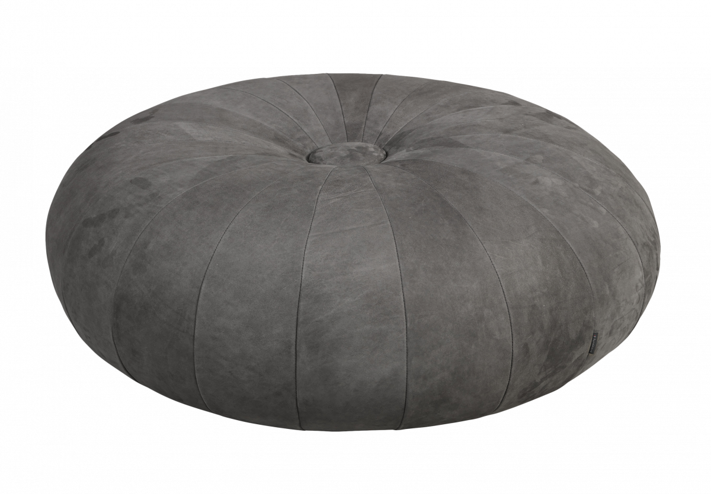

One of my favorite mathematical shapes is the torus. Not only does it remind me
of a doughnut (mmm), but it's the first step into topology with the introduction
of a hole. Not only is a doughnut topologically a torus, but so is your
accompanying coffee mug[^1]!

But where does this word _"torus"_ come from? It happens to be the Latin word
for... a pillow. The classic round poof with a pin through the middle to keep it
flat[^2].

Later used to describe architectural decoration that reminded them of that
shape, in particular the rounded molding at the base of some Doric columns.

I find it fascinating how words we consider academic and sterile have roots in
everyday things. "That column base looks like a fluffy pillow, let's call it so"
led to a defined term as mathematics provided architectural rigor.

[^1]:
    This homeomorphism famously leads dedicated topologists to confuse their mug
    and doughnut.

[^2]: Pillows lack a hole and are decidedly a non-toroidal "torus".
